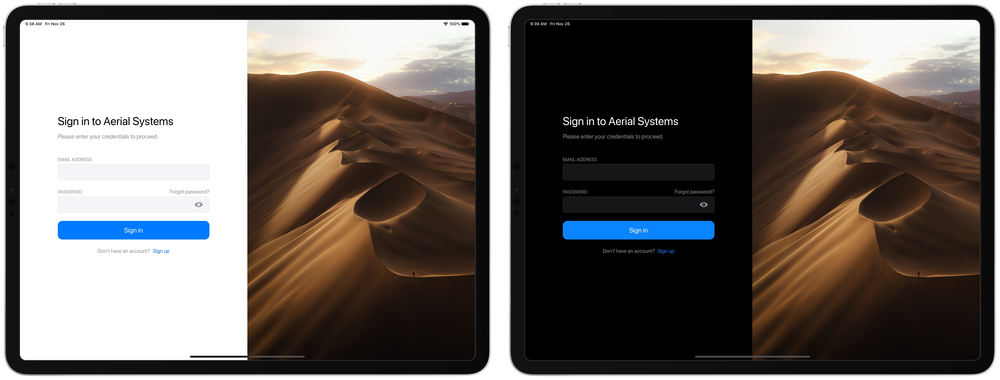

# Aerial Systems
This repository contains my Bachelor Semester Project 5 at the University of Luxembourg which is an iPad App for Drone Missions.
The app was built using the SwiftUI framework.

* [Requirements](#requirements)
* [Installation](#installation)
* [Connect with DJI App](#connect-with-dji-app)
* [Build and simulate](#build-and-simulate)
* [Connect a drone to the iOS simulator](#connect-a-drone-to-the-ios-simulator)
* [Contact](#contact)

<!---->

## Requirements
* Xcode version >= 13.1
* iOS version >= 15.0

## Installation
1. Clone the repository to your computer: `git clone https://github.com/Flavio8699/Aerial-Systems.git`
2. Enter the newly created directory (Mac): `cd Aerial-Systems`
3. Install the necessary pods with `pod install`

## Connect with DJI App
1. Go to https://developer.dji.com/user/apps
2. Click on **CREATE APP**
3. Create a DJI App according to your needs
4. Once the app is created, copy the **App Key**
5. Go to **Info.plist** and change the value of **DJISDKAppKey** to your key

## Build and simulate
1. Open the project file ***AerialSystems.xcworkspace***
2. Once Xcode is open, wait until all the third-party libraries are fully downloaded and ready to run
3. Connect your ***iPad*** with a USB cable to your computer or select the desired ***simulator*** on the top left corner
4. Tap the *Run* button (or <kbd>Command</kbd> + <kbd>R</kbd>) and wait until all the tasks are finished

## Connect a drone to the iOS simulator
To connect a drone to the iOS simulator, the **DJI Bridge App** is required. Since you cannot connect the drone's remote controler to an iOS simulator, you need to connect the remote controler to a physical device with the Bridge App. This app will forward everything wirelessly to the simulator on your computer.
1. Download and install the ***DJI Bridge App*** on a physical device (it doesn't matter if it is a phone, tablet or android phone).
2. Turn on the drone and remote controler.
3. Connect the remote controler to your device.
4. Open the app and copy the ***IP Address*** displayed in the application.
5. In Xcode, open the file ***DJIDroneManager.swift*** and do the following changes on line **14 & 15**:
```swift
fileprivate let enableBridgeMode = true
fileprivate let bridgeAppIP = "IP ADDRESS"
```
6. Build and run the app  with <kbd>Command</kbd> + <kbd>R</kbd>.


## Contact
* [Flavio Matias](mailto:flavio8699@gmail.com) (Student)
* [Benoît Ries](mailto:benoit.ries@uni.lu) (Tutor)
